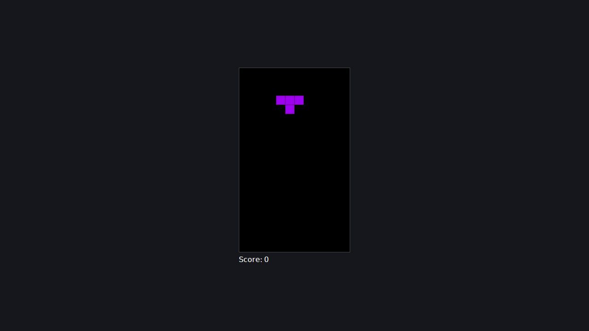

# ts-tetris

[](https://github.com/yamam-9v/ts-tetris/actions/workflows/ci.yml)

## 概要

TypeScript を身につけることを目的とした学習プロジェクト  
動くテトリスはその副産物  

## デモ

https://yamam-9v.github.io/ts-tetris/

## スクリーンショット



## 技術スタック

[](https://www.typescriptlang.org/)
[](https://vitejs.dev/)
[](https://vitest.dev/)
[](https://eslint.org/)
[](https://prettier.io/)

- TypeScript(`strict: true`)
- Vite(`vanilla-ts` テンプレート)
- Canvas 2D API
- Vitest
- ESLint(Flat Config、型情報ベースの `recommendedTypeChecked`)/ Prettier
- Dev Container
- GitHub Actions(CI)

## 設計上のこだわり

### 型設計

- 判別可能ユニオンを用いてGameStateを表現することで､バリアントごとに異なるプロパティを持たせ､neverで網羅チェックを出来るようにした
- テストをしやすくするため､ロジックを描画から切り離し純粋関数にした
- localStorageからハイスコアを取得する際､JSON.parseからunknown型として受け取り､型述語を用いて検証するステップを設けた

### 開発ワークフロー

- Dev Containerで開発環境を構築した
- mainブランチにプッシュ・プルリクエストされた時にCIが走り、`typecheck` / `lint` / `format` / `test` を自動実行するようにした
- branch protectionでmainブランチを保護し､CIが通らないとマージできないようにした

## セットアップ

```bash
npm create vite@latest tetris-ts -- --template vanilla-ts
cd tetris-ts
npm install
npm run dev
```

## 学習プロセスについて

- 学習には Claude Code の Output Style を `Learning` にした上で活用した
- このスタイルでは型定義･ロジックは自分で実装し､Claudeはレビュー･解説に徹する
- まずは自分で考え､分からないところは聞き､MDNやWeb記事も読みながら型や関数について学習を進めた

- 詳細な方針・スコープ・コーディング規約: [`tetris-ts-learning-plan.md`](./tetris-ts-learning-plan.md)
- 進捗ログ・現在の状態: [`work-log.md`](./work-log.md)